# 과외 3번째 주 
## CSS
### 가상 요소
가상 요소는 선택자에 추가하는 키워드로, 선택한 요소의 일부분에만 스타일을 입힐 수 있습니다. 
가상 요소는 가상 클래스와 달리 요소의 특정 부분에 스타일을 적용할 때 사용됩니다. 

* 가상 요소(Pseudo-elements)는 요소의 특정 부분을 선택합니다.
* 가상 클래스는 콜론을 한 개(:), 가상 요소는 콜론을 두 개(::)씁니다. 하지만 콜론을 한 개(:)만 써도 대부분의 브라우저에서 제대로 작동합니다.

#### ::first-line
`::first-line` 은 요소의 첫번째 줄을 선택합니다.   
 예를 들어
 
 ```
 p::first-line {
     color: red;
 }
 ```

<br/>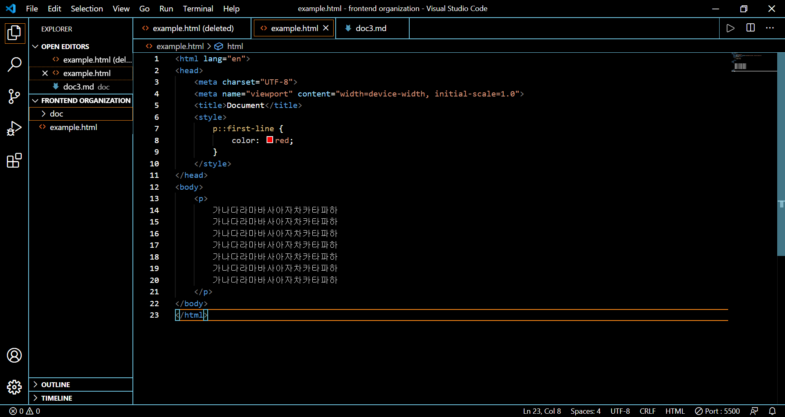 <br/>

<br/>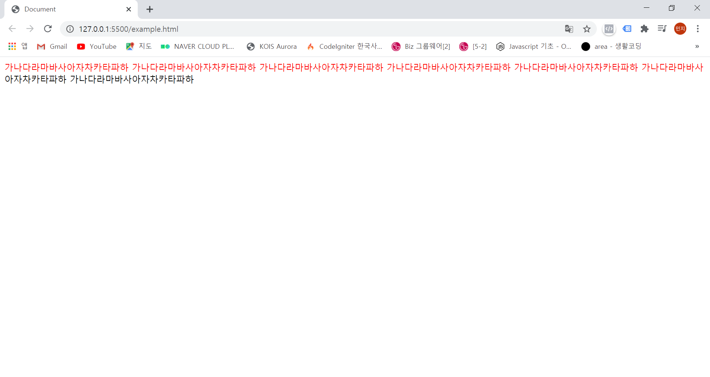 <br/>

이렇듯, 요소의 첫번째 줄의 css를 적용할 수 있습니다.

#### ::fisrt-letter
`::first-letter` 는 요소의 첫번째 문자를 선택합니다.   
예를 들어

```
p::first-letter {
    color: red;
}
```

<br/>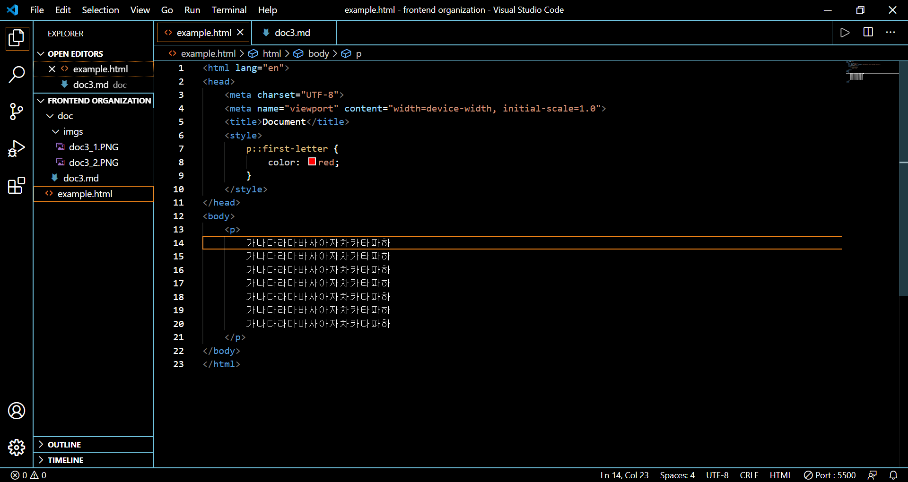 <br/>

<br/>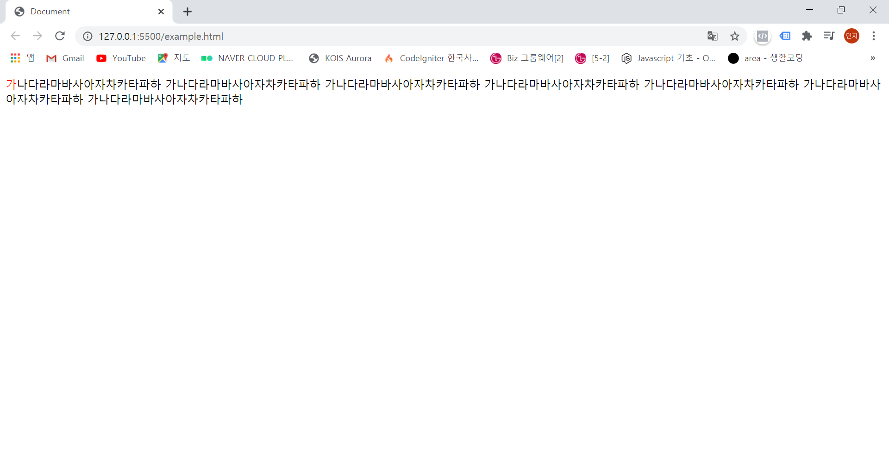 <br/>

이렇둣, 요소의 첫번째 문자를 문자에 css 를 적용할 수 있습니다.

#### ::beofore
`::before` 는 요소의 앞을 선택합니다.   
예를 들어

```
p::before {
    content: "hello world!";
    color: red;
}
```

<br/>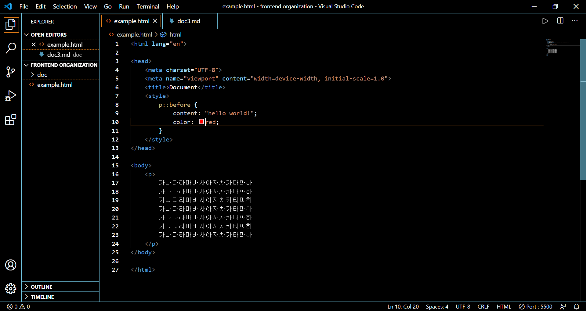 <br/>

<br/>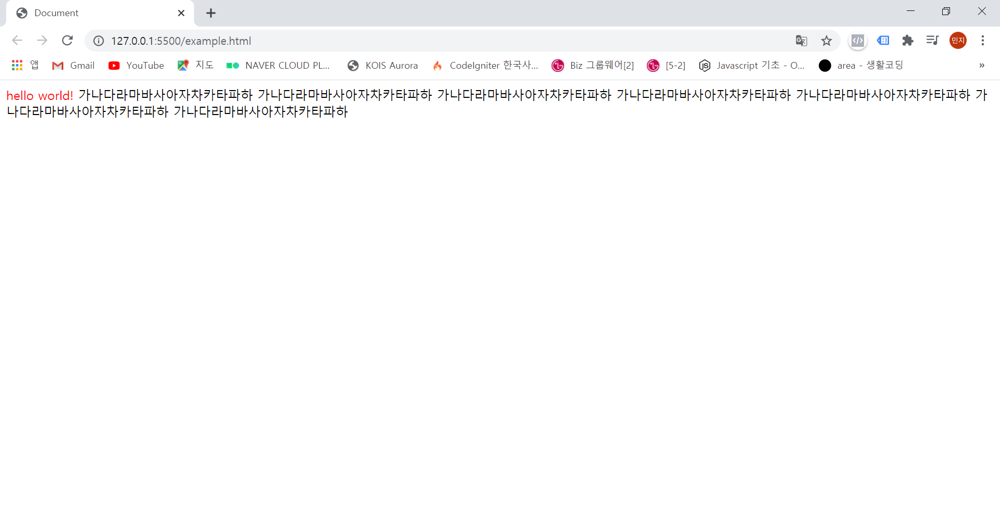 <br/>

이렇듯, 선택된 요소 앞에 css를 적용할 있습니다.

#### ::after
`::after` 는 요소의 뒤를 선택하니다.   
예를 들어

```
p::after {
    content: "bye world";
    color: blue;
    font-size: 30px;
}
```

<br/>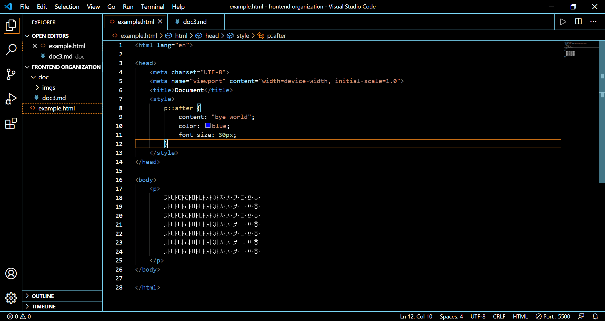 <br/>

<br/>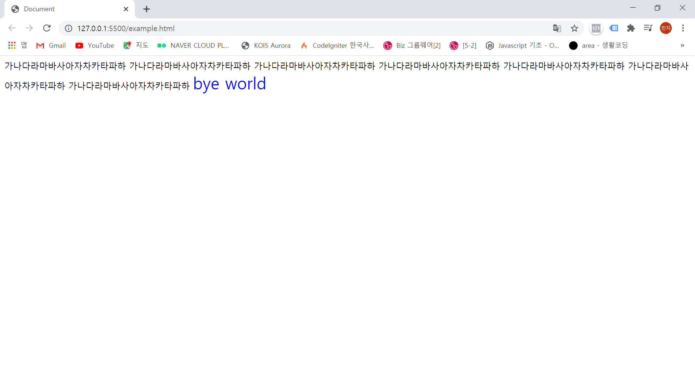 <br/>

#### ::selection
`::section` 은 마우스 드래그 등으로 선택한 텍스트를 선택합니다.    
예를 들어,

```
p::selection {
    color: blue;
    background-color: black;
}
```

<br/>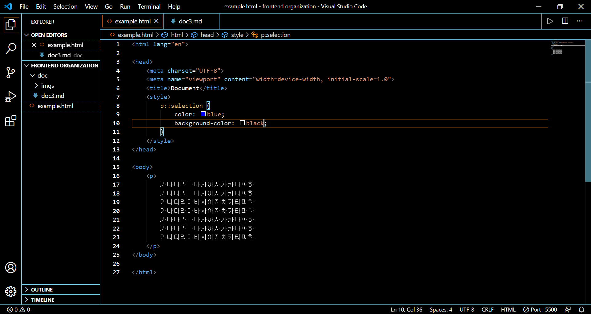 <br/>

<br/>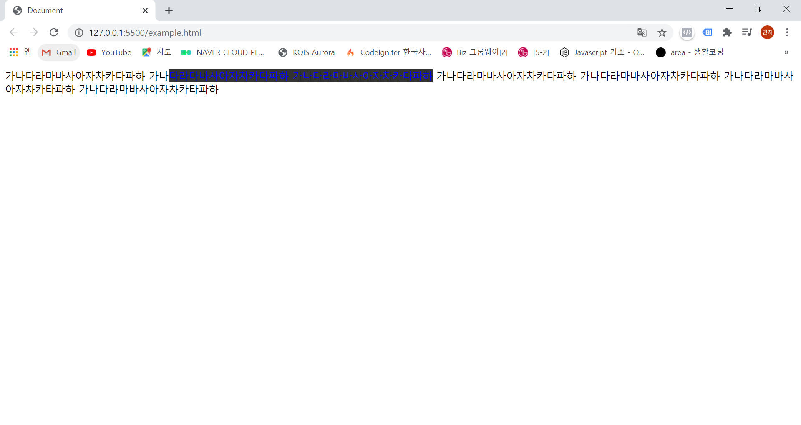 <br/>

#### ::placeholder
`::placeholder` 가상 요소는 `<input>`이나 `<textarea>` 요소 안에 있는 placeholder text를 선택합니다.

대부분의 브라우저에서는 원래 밝은 회색의 컬러를 placeholder에 기본적으로 제공합니다.

그러나 이를 바꾸고자 한다면,    
예를 들어

```
input::placeholder {
    color: orange;
}
```
라고 한다면,

<br/>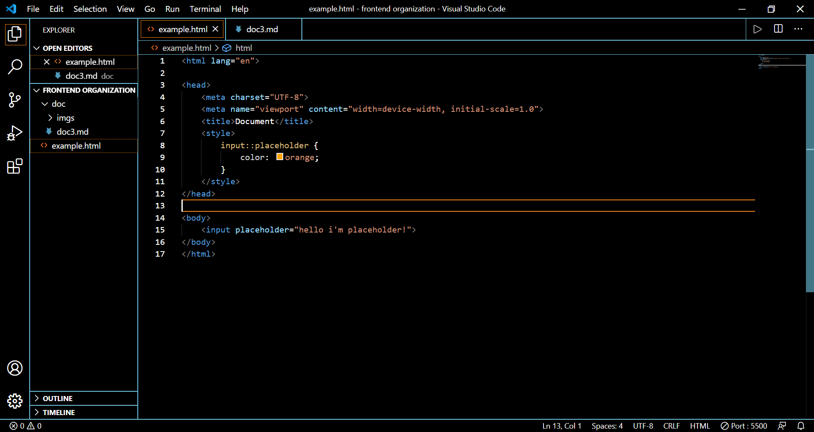 <br/>

<br/>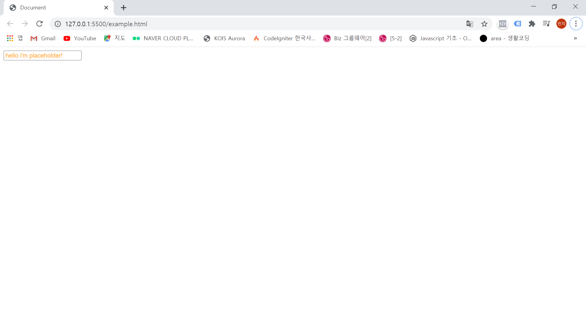 <br/>

#### ::backdrop
`::backdrop` 가상 요소는 풀 스크린 모드에서 제공되는 요소의 밑에 렌더링 되는 viewport의 박스 사이즈 입니다. Fullscreen API나 `<dialog>` 요소를 사용하는 풀스크린 모드에 위치되는 요소 들을 포합합니다.

여러 요소를 전체 화면 모드로 설정 한 경우 배경은 해당 요소의 맨 앞과 이전의 전체 화면 요소 바로 위에 그려집니다.

모든 풀스크린 요소들은 (LIFO)의 스택방식으로 레이어 되며, 이는 대부분 컨텐츠가 스크린에 그려지기 전에 랜더링 되는 viewport의 렌더와는 다르다는 특별한 점이 있습니다. `::backdrop` 를 사용하면 맨 위 레이어에서 맨 위에있는 요소 아래에있는 모든 요소에 스타일을 지정하거나 완전히 숨길 수 있습니다.

`::backdrop` 요소는 다른 요소를 상속하거나 상속되지 않습니다. 

이 요소는 비디오가 풀스크린 모드로 전환될 때 사용될 수 있습니다.

```
video::backdrop {
  background-color: #448;
}
```
이런식으로 사용될 수 있습니다.

#### ::grammar-error
`::grammar-error` 요소는 사용자가 문법적으로 잘못된 것으로 플래그 지정된 텍스트 세그먼트를 나타낼 때 사용됩니다.
(현재는 사용할 수 있는 브라우저가 없습니다.)

#### ::slotted()

#### ::cue
`::cue` 가상 요소는 WebVTT 큐들의 선택된 요소와 매치됩니다. 

```
::cue {
  color: #fff;
  background-color: rgba(0, 0, 0, 0.6);
}
```
이런식으로 사용할 수 있습니다.

##### WebVTT 
WebVTT는 Web Video Text Tracks Format 의 약자로 지정한 시간에 따라 비디오 `<video>` 내에서 사용할 수 있는 텍스트입니다. 비디오 내에서 이 글자 트랙들이 보여지게 되는데 이때 `<track>` 태그를 사용합니다. 
WebVTT는 text/vtt 형식으로 되어 있으며 이 파일은 .vtt 로 끝납니다. 

```
WEBVTT

00:01.000 --> 00:04.000
Never drink liquid nitrogen.

00:05.000 --> 00:09.000
- It will perforate your stomach.
- You could die.
```

위와 같이 사용할 수 있습니다.

```
<video controls autoplay src="video.webm">
 <track default src="track.vtt">
</video>
```
그리고 이런 방식으로 비디오 태그 내에 트랙 태그를 삽입하여 사용할 수 있습니다.

혹은 .vtt 파일 내에 style을 삽입하여 사용할 수도 있습니다.

```
WEBVTT

STYLE
::cue {
  background-image: linear-gradient(to bottom, dimgray, lightgray);
  color: papayawhip;
}
/* Style blocks cannot use blank lines nor "dash dash greater than" */

NOTE comment blocks can be used between style blocks.

STYLE
::cue(b) {
  color: peachpuff;
}

00:00:00.000 --> 00:00:10.000
- Hello <b>world</b>.

NOTE style blocks cannot appear after the first cue.
```

#### ::part()
`::part()` 가상 요소는 shadow DOM 스타일링을 위해 사용됩니다.

### 가상 클래스
가상 클래스는 선택자에 추가하는 키워드로 선택한 요소가 특별한상태여야 만족할 수 있습니다.   
예를 들어 :hover 를 사용하면 포인터를 올렸을 때만 css를 적용할 수 있습니다.
가상 클래스를 사용하면 문서의 트리 콘텐츠와 관련된 경우 뿐 아니라 타마색기 히스토리(:visited), 콘텐츠의 상태(특정 폼요소에 적용한 :checked), 마우스 위치(:hover)처럼 외부 인자와 관련된 경우에도 스타일을 적용할 수 있습니다.
가상 클래스는 가상 요소와 달리 요소의 특정 상태에 스타일을 적용할 때 사용됩니다.

#### :empty
`:empty` 는 내용이 없는 빈 요소를 선택합니다. 

```
div.empty
```

는 div요소 중 내용이 없는 것을 선택합니다.

```
<div></div>
```
가 선택됩니다.   

```
<div> </div>
```
그러나 만약에 위처럼 공백이 있다면 그 공백도 내용이 있는 것으로 처리되기 때문에 유의하셔야 합니다.
위처럼 빈 칸이 있다면 선택되지 않습니다.

<br/>
예를 들어

```
div {
    height: 30px;
    background-color: black;
}
```
이라면

<br/>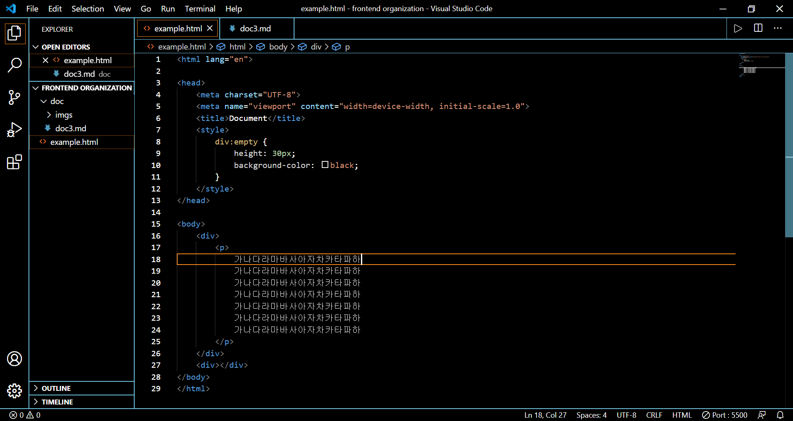 <br/>

<br/>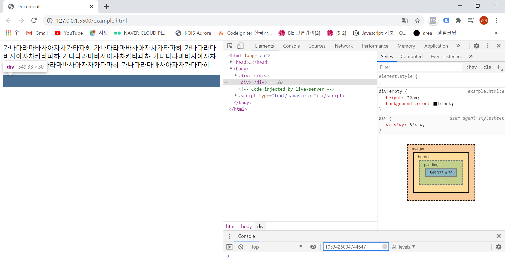 <br/>

이렇듯, empty는 비어있는 요소에 css를 적용할 수 있습니다.

#### :first-child
`:first-child` 는 형제 요소 중 첫번째 요소를 선택합니다.

예를 들어,

```
p:first-child {
    height: 30px;
    background-color: black;
    color: brown;
}
```
이라면

<br/>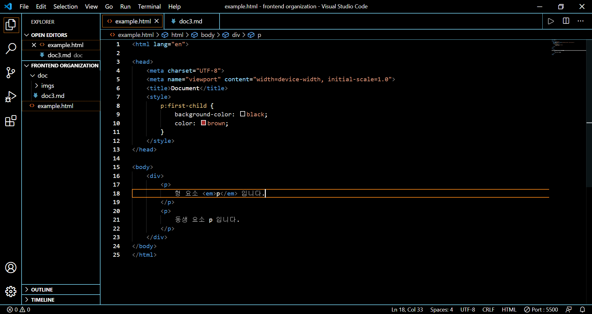 <br/>

<br/>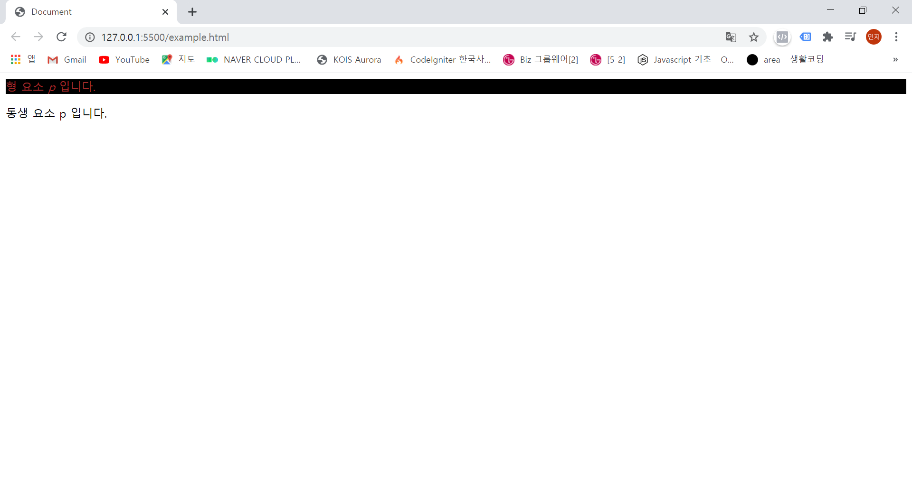 <br/>

이렇듯, `:first-child` 는 형제 요소 중 첫번째 요소에 css를 적용할 수 있습니다.

#### :hover
`:hover` 는 요소에 마스를 욜린 상태를 의미합니다.
예를 들어

```
div:hover {
    background-color: blue;
}
```
라고 한다면,   

<br/>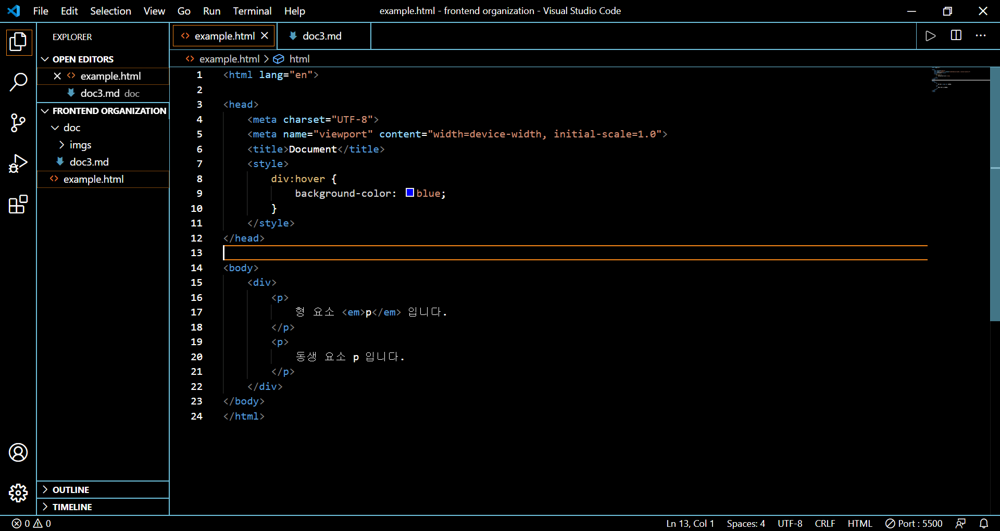 <br/>

마우스를 div위에 올리면,

<br/>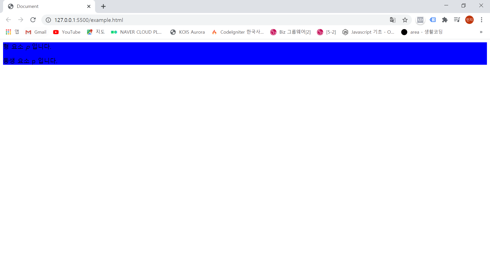 <br/>

이렇게 변하는 것을 볼 수 있습니다.

#### :visitied
사용자가 방문한 적있는 링크를 나타냅니다. 
`visited` 가 바꿀 수 있는 스타일은 개인정보 보호를 위해 매우 제한적입니다.
`visited` 로 정의한 스타일은 자신보다 위에 위치하고 동등한 명시성을 가진 다른 링크 의사 클래스(`:link`, `:hover`, `:active`)가 덮어씁니다. 링크를 적절히 디자인하려면 LVHA순서(`:link` - `:visited` - `:hover` - `:active`)를 따라 `:visied` 규칙을 `:link` 뒤, `:hover` 와 `:active` 앞에 배치하세요.

#### :active
사용자가 활성화한 요소(버튼 등)을 나타냅니다. 마우스를 사용하는 경우, '활성'이란 보통 마우스 버튼을 누르는 순간부터 떼는 시점까지를 의미합니다.
`:active` 가상 클래스는 대개 `<a>`, `<button>` 과 함께 사용합니다. 다른 흔한 대상으로는 활성화된 요소를 포함한 다른 요소와, 연결된 `<label>`로 선택한 입력 폼 요소 등이 있습니다.

`:active` 가상 클래스로 정의한 스타일은 자신보다 뒤에 위치하고 동등한 명시서을 가진 링크 가상 클래스가 덮어 씊니다. 링크를 적정히 디자인 하려면 LVHA순서를 따라, `:active` 규칙을 다른 모든 링크 규칙들보다 뒤에 위치 시키세요ㅛ.

#### :link

#### :enabled
모든 활성 요소를 나타냅니다. 활성 요소란 활성(선택, 클립, 입력 등)하거나 포커스를 받을 수 있는 요소를 말합니다. 반대 상태인 비활성 요소도 존재합니다.

#### :disabled
모든 비활성 요소를 나타냅니다. 비활성 요소란 활성(선택, 클릭, 입력 등)하거나 포커스를 받을 수 없는 요소를 말합니다.

#### :focus
`<input>`과 같은 요소들이 포커싱이 될 때를 나타냅니다. 사용자가 클릭을 하거나 탭을 눌러 그 요소에 탭이 올라갔을 때 이 클래스가 사용됩니다.

#### :chcked
선택을 했거나 `on` 상태인 라디오(`<input type=radio>`), 체크박스(`<input type="checkbox">`), 옵션(`<option>`) 요소를 나타냅니다.
사용자가 요소를 체크했거나 선택한 경우 활성화되고, 체크나 선택을 헤제하는 경우 비활성화 됩니다.


#### :indeterminate
결정되지 않은 `<form>` 요소를 나타냅니다.
* `inderminate` 프로퍼티를 가지는 `<input type="checkbox">` 요소는 자바스크립트에의해 `true`로 설정되어 있습니다.
* `<innput type="radio">` 요소는, `form`에서 `name` 값이 같은 모든 라디오 버튼들이 체크되어 있지 않다면 사용할 수 있습니다.
* `<progress>` 요소는 결정되지 않은 상태입니다.

#### :default
관련되어 있는 요소들의 그룹에서 default되어 있는 폼 요소를 선택합니다. 이 가상 클래스는 `<button>`, `<input type="checkbox">`, `<input type="radio">`, `<option>`에서 사용할 수 있습니다.
* default인 옵션 요소는 `selected` 속성을 가지고 있는 첮번째 요소이거나, DOM 순서에 따라서 처음으로 사용가능한 옵션을 의미합니다. `<select>`가 여러 개이면 그만큼 `selected` 속성을 가지고 있는 요소들이 있는 거고 그것들은 모두 `:default`를 사용할 수 있습니다.
* `<input type="checkbox">`와 `<input type="radio">`에서는 `checked` 속성을 가지는 요소만 사용가능합니다.
* `<button>`은 `<form>`에서 기본적인 제출 버튼이 있다면 사용가능합니다. 

예를 들어,   
<br/>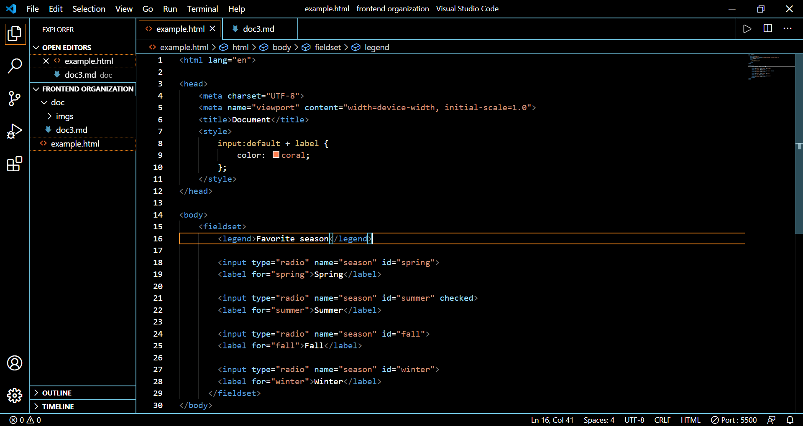 <br/>

<br/>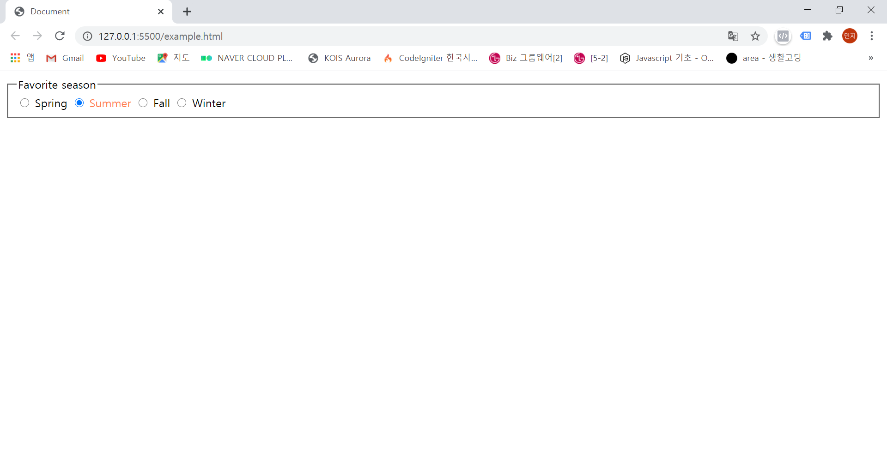 <br/>
이런식으로 사용할 수 있습니다.

#### :valid
모든 `<input>`이나 `<form>` 요소에서 컨텐츠가 성공적으로 확인된 것을 나타냅니다. 사용자에게 그들의 데이터가 정절하게 들어가 있음을 표현해주기 위해 사용합니다.
이 가상 클래스는 사용자에게 알맞는 필드를 하이라이팅해주기에 유용합니다.

예를 들어

```
<html lang="en">

<head>
    <meta charset="UTF-8">
    <meta name="viewport" content="width=device-width, initial-scale=1.0">
    <title>Document</title>
    <style>
        input+span {
            position: relative;
        }

        input+span::before {
            position: absolute;
            right: -20px;
            top: 5px;
        }

        input:invalid {
            border: 2px solid red;
        }

        input:invalid+span::before {
            content: '✖';
            color: red;
        }

        input:valid+span::before {
            content: '✓';
            color: green;
        }
    </style>
</head>

<body>
    <div>
        <label for="fname">First name *: </label>
        <input id="fname" name="fname" type="text" required>
        <span></span>
    </div>
</body>

</html>
```
위 코드처럼 사용하면
<br/>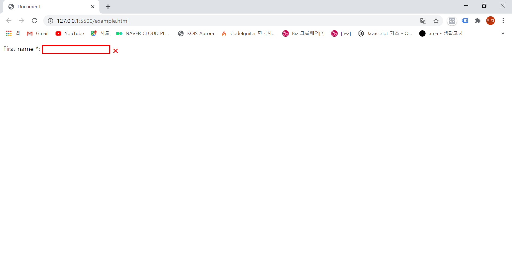 <br/>

<br/>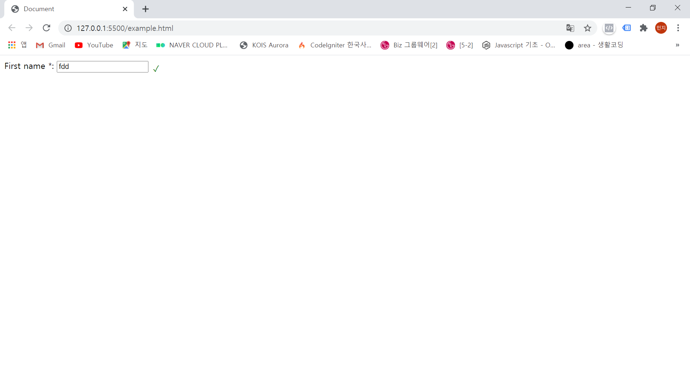 <br/>

이렇게 사용 가능합니다.

#### :in-range
`<input>` 요소 중에서 현재값의 범위가 `min`과 `max` 속성으로 정의되어 있는 경우, 그 범위 내에 값이 있을 때를 나타냅니다.   
예를 들어

```
<html lang="en">

<head>
    <meta charset="UTF-8">
    <meta name="viewport" content="width=device-width, initial-scale=1.0">
    <title>Document</title>
    <style>
        input:in-range {
            background-color: rgba(0, 255, 0, 0.4);
        }
        input:in-range + label::after {
            content: "있습니다.";
        }
        input:out-of-range {
            background-color: rgba(255, 0, 0, 0.4);
            border: 3px solid red;
        }
        input:out-of-range + label::after {
            content: "없습니다. 다시 시도하세요.";
        }
    </style>
</head>

<body>
    <form action="">
        <input name="input1" type="number" min="1" max="100" value="1000">
        <label for="input1">값이 범위 내에 </label>
    </form>
</body>
</html>
```
이렇게 사용된다면,
<br/>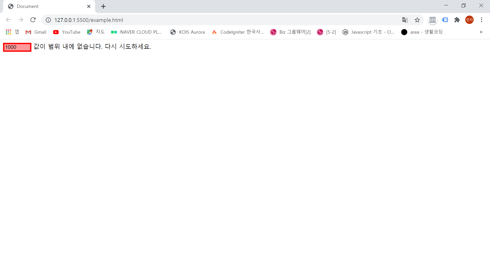 <br/>

<br/>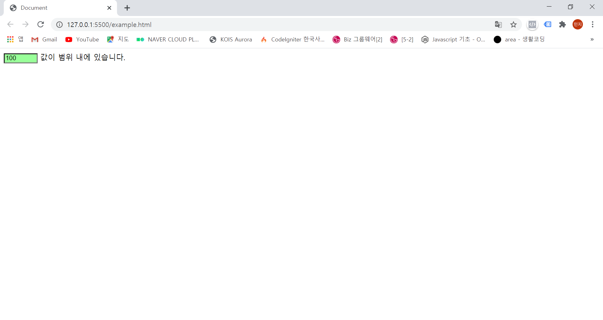 <br/>

위와 같은 결과를 도출할 수 있습니다.

#### :out-of-range
위의 `:in-range` 과 반대로 값의 범위를 벗어났을 때 사용할 수 있는 가상 요소입니다.

#### :required
`<input>`, `<select>`, `<textarea>`와 같은 요소들이 `required` 속성을 가지고 있는 것을 나타냅니다.
이 가상클래스는 반드시 확인되어야하는 필드를 하이라이팅할 때 유용합니다.

#### :optional
위 `:required`와 반대로 반드시 필요하진 않은 필드를 나타냅니다.

#### :read-only
`<input>`이나 `<textarea>` 같은 요소들이 사용자에 의해 수정될 수 없음을 나타냅니다.

#### :read-write
위 `:read-only`와 반대로 사용자에 의해 수정될 수 있는 것을 나타냅니다.

#### :nth-child()
형제 중에 특정 순서에 있는 요소를 선택할 때 사용됩니다.
`:nth-child()`는 앞에서부터 셉니다.

```
nth-child(xn+b)
```
로 사용합니다.
* x와 y는 정수입니다. 0과 음수도 가능합니다.
* n은 음이 아닌 정수로 차례대로 대입됩니다.
xn + y 대신 `even`,`odd`로 사용할 수 있습니다.   
예를들어

```
<html lang="en">

<head>
    <meta charset="UTF-8">
    <meta name="viewport" content="width=device-width, initial-scale=1.0">
    <title>Document</title>
    <style>
        li:nth-child(2n) {
            color: salmon;
        }
        li:nth-last-child(2n) {
            color: skyblue;
        }
    </style>
</head>

<body>
    <ul>
        <li>1</li>
        <li>2</li>
        <li>3</li>
        <li>4</li>
        <li>5</li>
        <li>6</li>
        <li>7</li>
        <li>8</li>
    </ul>
</body>

</html>
```

이렇게 사용한다면
<br/>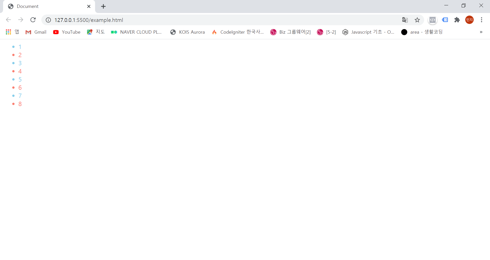 <br/>

#### :nth-last-child()
위 `:nth-child()`의 예시와 같이 사용할 수 있습니다.
이 가상 클래스는 뒤에서부터 숫자를 셉니다.

#### :not()
이 요소는 선택자들 사이에서 매치되는 것이 없을 때를 나타냅니다. 
* `:not()` 가상 클래스는 중첩되지 않습니다. `:not(:not()) 이런식으로 사용하실 수 없습니다.
* 가상클래스는 단순한 선택자가 아니므로 `:not()`에 대한 유효한 인수가 사용되어야 합니다. 예를 들어 `:not(p::before)`과 같이 사용하실 수 없습니다.
* 이 가상 클래스를 사용하여 높은 고유성을 가질 수도 있게 합니다. 예를들어 `#foo:not(#bar)` 이렇게 사용하면 #foo 의 의미를 더 명확히하는 선택자가 될 수 있습니다.

#### :is()
`:is`는 최근 `:matches`로 이름이 바뀌었다고 합니다. `:any()`로도 사용할 수 있습니다.
이 가상클래스는 요소가 선택된 것을 나타냅니다. 
#### 브라우저상의 호환
브라우저 사이의 css호환을 위해
```
:-webkit-any(header, main, footer) p:hover {
  color: red;
  cursor: pointer;
}

:-moz-any(header, main, footer) p:hover {
  color: red;
  cursor: pointer;
}

:matches(header, main, footer) p:hover {
  color: red;
  cursor: pointer;
}

:is(header, main, footer) p:hover {
  color: red;
  cursor: pointer;
}
```
위와같이 다양한 클래스의 이름을 사용합니다.
<br/>
위 접두어들은 다음과 같은 의미를 가집니다.
* -webkit-: 구글, 사파리 브라우저에 적용
* -moz- : 파이어폭스 브라우저에 적용
* -ms- : 익스플로러에 적용
* -o- : 오페라 브라우저에 적용
<br/>
이는 어떤 가상 요소와 가상 클래스를 사용하고 있느냐에 따라 해당 접두어를 가진 가상 요소, 클래스가 존재할 수도 있고 아닐 수도 있습니다. 해당 브라우저에서 그 가상 요소와 가상 클래스를 제공하고 있다면 위와 같은 접두어와 혼합한 이름의 요소(클래스)가 없으나, 해당 브라우저에서 지원하지 않는 기능이라면 위와같은 접두어들을 사용하는 요소(클래스)가 존재하고 있습니다.
<br/>
