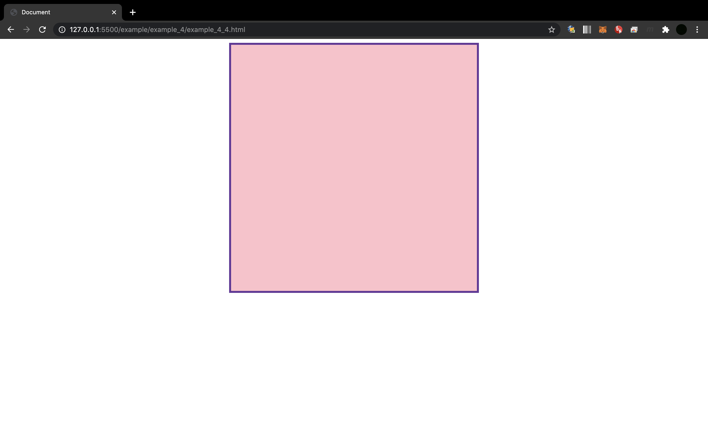
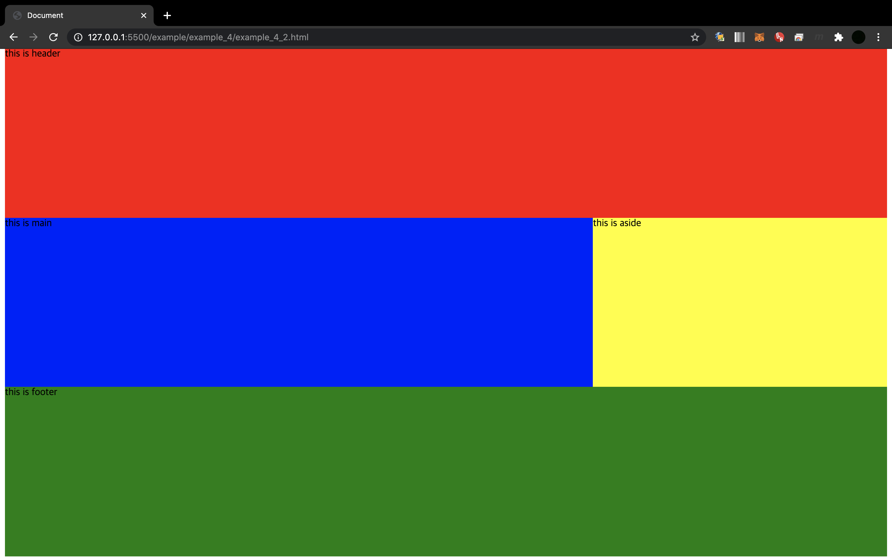

# 과외 4번째 주 

## github desktop 추가사항
깃으로 협업하고 있는 프로젝트는 반드시 코드를 수정하기 전에 'git pull' 을 해줘야 합니다🙌       
우선 github desktop에서 pull하기 위해선

<br/> <br/>

위와 같이 하시면됩니다. 원격 레포지터리에 변경사항이 생기면 위 사진과 같인 `pull origin` 이라고 뜹니다.     
반대로 로컬 레포지터리에 변경사항이 생기면 `push origin`이라고 뜹니다.      
위와 같이 변경사항이 있다면 코드를 수정하기 전에 무조건 `pull origin`을 하셔야 다른 브랜치와 충돌을 막을 수 있습니다 :star2:        
그렇다면 jewelrye님은 `onegye-petch-one` 브랜치에서 `pull origin`을 하시면 됩니다!!         

## css
### font
#### font-family
글꼴을 바꾸기 위해선 `font-family` 속성을 사용하서야 합니다.    
`font-family: font | initial | inherit | unset`
* `font`: family name or generic-family
* `initial`: 기본값으로 설정
* `inherit`: 부모요소의 값을 상속받음    
* `unset`: 부모로부터 상속할 값이 존재하면 상속값을, 그렇지 않다면 초깃값을 사용합니다. 다르게 표현하자면, 전자일 땐 `inherit` 키워드처럼, 후자일 땐 `initial` 키워드처럼 동작합니다.  
`font`는 작은 따옴표 혹은 큰 따옴표로 감싸 표기합니다. 그리고 `generic-family`는 글꼴 유형입니다.       

`generic-family` 종류는 아래와 같습니다.
* `serif`
* `sans-serif`
* `monospace`
* `cursive`
* `fantasy`     

글꼴이 지원되지 않을 수도 있기 때문에 아래와 같이 여러 개를 쉼표로 나누어 적습니다.
```
font-family: "a-font", serif;
```
이렇게 했을 때 `a-font`가 지원이 되지 않거나 문제가 생겼을 경우, `generic-family`인 `serif`가 대신 사용됩니다.      

<br/>
폰트를 사용하고자 한다면 무료 배포 가능한 글꼴들을 `html`이나 `css`에 import해야합니다.
이러한 폰트들을 제공해주는 사이트들이 있습니다. 대표적으로,        
[Google Fonts]: https://fonts.google.com/         
[눈누 상업용 무료한글폰트 사이트]: https://noonnu.cc/              
이 곳에 들어가시고 원하는 폰트를 클릭한다음 라이센스관련 사항을 잘 읽으시고 사용가능하다면

<br/> <br/>

여기파일과 같이 `@font-face`로 시작하는 코드가 복사됩니다.  
그 후 공통 css 파일에 복사한 코드를 붙여넣습니다.
이렇게 하면 코드를 사용할 수 있는 선언이 완료된 것입니다.
그런 다음 원하는 영역에서 `font-family: "Mapo..";` 이렇게 코드를 적어주시면 됩니다.     
예를들어 전체 파일에 적용하고 싶다면 공통 css 파일에서 
```
* {
    font-family: 'MapoGoldenPier', serif;
}
```
이렇게 하시면 되겠죠🥳?     

<br/>

간혹 import해야할 코드에서 폰트 형식을 확인하면 `woff2`로 되어 있는 폰트가 있습니다. 이는 IE에서 적용되지 않고 에러가 나는 경우가 있으므로 `woff` 파일도 함께 다운로드 해야합니다.      

#### font-size
`font-size`는 글자의 크기를 변경하는 속성입니다.        
`font-size`는 `medium | xx-small | x-small | small | large | x-large | xx-large | smaller | larger | length | initial | inherit | unset` 이 중에서 결정할 수 있습니다.  
`font-size`는 기본적으로 상속됩니다.            

* `larger`, `smaller`: 부모요소에 비해 상대적인 글자 크기입니다.
* `length`: px, %, em, rem 등으로 크기를 정합니다.
    * `%`와 `em`: 부모요소의 상대적인 글자 크기입니다. `100%`와 `1em`은 부모요소의 글자크기와 같습니다.
    * `rem`: 최상위 부모 요소인 html 요소의 상대적인 글자 크기입니다.
* `medium`: 브라우저에서 정한 기본 글자 크기입니다.
* `initial`: 기본값으로 결정합니다.
* `inherit`: 부모요소의 값을 상속받습니다.

#### font-style
`font-style`은 기울임 여부를 결정합니다.        
`font-style`은 `normal | italic | oblique | initial | inherit | unset`을 사용할 수 있습니다.        
`font-style`은 기본적으로 상속됩니다.

* `normal`: 보통모양입니다.
* `italic`: 필기체 느낌으로 기울입니다.
* `oblique`: 글자 그대로 기울입니다.
* `initial`: 기본값으로 결정합니다.
* `inherit`: 부모요소의 값을 상속받습니다.


#### font-variant
`font-variant`는 소문자 크기의 대문자로 바꾸는 속성입니다.      
`font-variant`는 `normal | small-caps | initial | inherit | unset`을 사용할 수 있습니다.        
`font-variant`는 기본적으로 상속됩니다.

* `small-caps`: 소문자를 소문자 크기의 대문자로 바꿉니다.       

#### font-weight
`font-weight`는 글자 굵기를 결정합니다.     
`font-weight`는 `normal | bold | bolder | lighter | number | initial | inherit | unset`을 사용할 수 있습니다.
`font-weight`는 기본적으로 상속됩니다.

* `normal` : 숫자 크기 400과 같습니다.
* `bold` : 숫자 크기 700과 같습니다.
* `bolder` : 상속된 값보다 굵은 굵기입니다.
* `lighter` : 상속된 값보다 얇은 굵기입니다.
* `number` : 100, 200, ..., 900

#### text-shadow
`text-shadow`는 글자에 그림자 효과를 주는 속성입니다.       
`text-shadow`는 `offset-x offset-y blur-radius color | none | initial | inherit | unset`을 사용할 수 있습니다.  
`text-shadow`는 기본적으로 상속됩니다. 

* `offset-x`: 그림자의 수평거리를 정합니다.(필수)
* `offset-y`: 그림자의 수직거리를 정합니다.(필수)
* `blur-radius`: 그림자의 흐림정도를 정합니다. (정하지 않으면 0)
* `color`: 그림자의 색을 정합니다. (정하지 않으면 브라우저 기본 색)     

#### letter-space, word scpace
`letter-space`는 글자사이의 간격을, `word-space`는 단어사이의 간격을 정합니다.      
값이 커지면 글자의 간격이 넓어지고, 작아질 수록 글자 간격이 좁아집니다. 값에 음수를 넣을 수도 있습니다.
`letter-space`와 `word-space`는 기본적으로 상속됩니다.      

### text
#### text-align
문단정렬 방식을 정하는 속성입니다.      
`text-align`은 `left | right | center | justify | initial | inherit | unset` 이 있습니다.       
`text-align`은  기본적으로 상속됩니다.
* `justify`: 양쪽 정렬입니다.

#### text-indent
`text-indent`는 들여쓰기와 내어쓰기를 하는 속성입니다. 양수면 들여쓰기, 음수면 내어쓰기를 합니다.        
`text-indent`의 기본 값은 0 입니다. 
`text-indent`는 기본적으로 상속됩니다.

#### line-height
`line-height`는 문단의 세로 높이를 결정하는 속성입니다.     
`line-height`는 `normal | length | number | percentage | initial | inherit | unset` 이 있습니다.
`line-height`는 기본적으로 상속됩니다.      
* `length`: 길이로 높이를 결정합니다.
* `number`: 글자크기의 몇 배인지를 수로 정합니다.
* `percentage`: 글자크기의 몇 배인지 %로 정합니다.      
`line-height`가 글자크기보다 작으면 세로 방향으로 글자가 겹치게 됩니다.     

#### coloms
`coloms`는 문단을 다단으로 만드는 속성입니다.       
단의 최소 가로 크기와 단의 최대 개수가 속성의 값입니다. 기본값은 auto로, 값을 입력하지 않으면 auto로 처리합니다.        
IE는 버전 10 이상을 지원합니다.     

```
p {
    coloms : 2;
}
```
로 하면 문단이 가로 2개로 나뉘어 집니다.

### pre
예를들어 `<p>`태그에 tap을 넣는다고 해도 이는 적용되지 않습니다.    
그래서 tap을 표시해야할 때가 있을 땐 `<pre>`를 사용합니다.
<br/> <br/>
<br/> <br/>
<br/> <br/>

## box model
### margin
`margin`은 바깥 여백을 의미합니다.      
### border
`border`은 테두리 영역을 의미합니다.
### padding
`padding`은 안쪽 여백 영역을 의미합니다.
### box-sizing
박스 크기를 어느 영역에서부터 계산할지 정하는 속성입니다.       
`box-sizing`은 `content-box | border-box | initial | inherit`이 있습니다.   
`box-sizing`은 기본적으로 상속되지 않습니다.
* `content-box`: 콘텐트 영역을 기준으로 그 크기를 정합니다.
* `border-box`: 테두리를 기준으로 그 크기를 정합니다.
### border-radius
`border-radius`는 테두리를 둥글게 만드는 속성입니다.    
IE는 9부터 지원합니다.      
속성 값 1개부터 8개까지 넣을 수 있습니다.

```
border-radius: top-left-x top-right-x bottom-right-x bottom-left-x / top-left-y top-right-y bottom-right-y bottom-left-y
```

[example_4_3.html]      

<br/> <br/>

[example_4_4.html]      

<br/> <br/>

```
border-radius: 20px 40px 80px 100px/ 100px 60px 30px 100px;
```
위 코드를 적용하면,

<br/> <br/>

```
border-radius: 40px 80px / 100px 30px;
```

위 코드를 적용하면,
<br/> <br/>
```
border-radius: a b / c d; 
border-radius: a b a b / c d c d;
```
위 두 코드는 같습니다.      

```
border-radius: 40px / 90px;
```
위 코드를 적용하면,
<br/> <br/>

```
border-radius: a / b;
border-radius: a a a a / b b b b;
```
위 두 코드는 같습니다.
<br/>

```
border-radius: 50%;
```
위 코드를 적용하면,
<br/> <br/>

```
border-radius: a;
border-radius: a a a a / a a a a;
```
위 두 코드는 같습니다.

### background-origin
`bakcground-origin`은 어느 영역부터 채워나갈지 정하는 속성입니다.        
`background-orign`은 `border-box | padding-box | content-box | initial | inherit` 이 있습니다.      
`background-orign`은 기본적으로 상속되지 않습니다.      
* `border-box`: 테두리 영역의 왼쪽 위부터 채워나갑니다.
* `padding-box`: 안쪽 영역의 왼쪽 위부터 채워나갑니다.
* `content-box`: 내용 영역의 왼쪽 위부터 채워나갑니다.

### background-position
`background-position`은 배경이미지를 어디서부터 채울지 정하는 속성입니다.
`background-position`은 `x-position y-position | initial | inherit` 이 있습니다.
`background-position`은 기본적으로 상속되지 않습니다.

* `x-position y-position`: 가로위치와 세로위치를 정합니다. (top, left, right, center, bottom, 백분율, 길이)

### background-repeat
`background-repeat`은 반복여부와 반복방향을 정하는 속성입니다.
`background-repeat`은 `repeat | repeat-x | repeat-y | no-repeat | inherit`이 있습니다.      
`background-repeat`은 기본적으로 상속되지 않습니다.

* `repeat`: 양쪽 모두 반복합니다.
* `repeat-x`: 가로방향으로 반복합니다.
* `repeat-y`: 세로방향으로 반복합니다.
* `no-repeat`: 반복하지 않습니다.

### backgound-size
`background-size`는 배경이미지와 가로 세로 길이를 정하는 속성입니다.    
`background-size`는 `auto | length | cover | contain | initial | inherit` 이 있습니다.      
`background-size`는 기본적으로 상속되지 안습니다.

* `auto`: 이미지 크기를 유지합니다.
* `length`: 값을 두개 넣으면 차례대로 가로 크기, 세로 크기입니다. 값을 하나만 넣으면 가로 크기이고 세로크기는 자동 조정됩니다.
* `cover`: 가로 세로 비율을 유지하며 배경을 채울 수 있도록합니다. 하나의 값이 커지면 잘립니다.
* `contain`: 가로 세로 비율을 유지하며 잘리지 않게 배경을 채울 수 있도록 합니다.

## grid_1
```
.container {
    heigth: 100hv;
    display: grid;
    grid-template-rows: repeat(3, 1fr);
    grid-template-columns: repeat(3, 1fr);
    grid-template-areas:
        "header header header"
        "main main aside"
        "footer footer footer";
}
header { grid-area: header; }
main   { grid-area: main;   }
aside  { grid-area: aside;  }
footer { grid-area: footer; }
```
<br/> <br/>

위와 같이 `grid`와 `grid-template-rows`, `grid-template-coloums`를 이용해서 2차원 행과 열을 만들 수 있습니다.       
##### fr
css 단위 중 하나인 `fr`은 유연한 크기를 갖는 단위입니다. 이는 그리드 컨테이너 내의 공간 비율을 분수(fraction)로 나타냅니다. 위에서처럼 `coloms`에 1fr을 적용하면 각 컬럼당 1/3 의 비율을 갖는 것입니다. 이렇게 각 3개의 컬럼에 1fr을 적용하고자 한다면 원래는 
```
something {
    display: grid;
    grid-template-colums: 1fr 1fr 1fr;
}
```
이렇게 해야합니다. 그러나 `repeat` 함수를 이용하여 여러번 반복되는 코드를 줄일 수 있게 됩니다.  
<br/>
만약 두 개의 칼럼의 비율을 다르게 하고 싶다면,
```
something {
    display: grid;
    grid-template-colums: auto 200px 1fr 3fr;
    ...
}
```
이렇게 하면 한쪽은 1/3 다른 한쪽은 2/3을 차지하게 됩니다.


