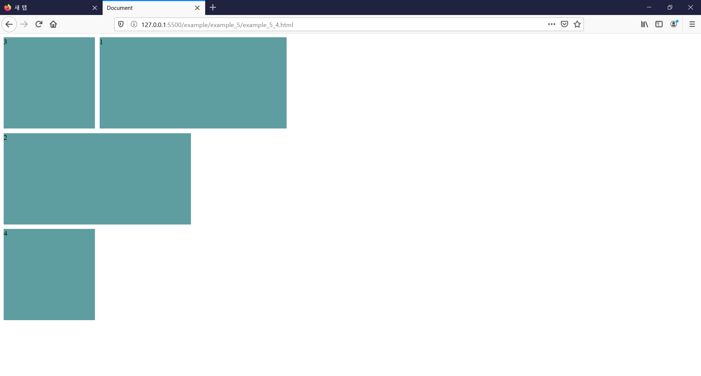
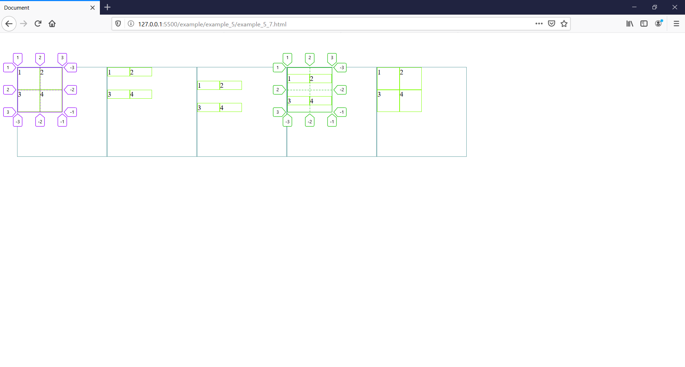

# 5번째 주

# css
## grid_2

### grid container properties

|속성|의미|예시
|--|--|--|
|display|그리드 컨테이너를 정의|`display: grid;`|
|grid-templeate-rows|명시적 행의 크기를 정의|`grid-template-rows: 1fr 1fr;`|
|grid-template-colums|명시적 열의 크기를 정의|`grid-template-colums: 1fr 1fr;`|
|grid-template-areas|영역 이름을 참조해 템플릿 생성|`grid-template-areas:"header header header" "main main main" "footer footer footer";`|
|grid-template|`grid-template-xxx`의 단축 속성->`grid-template-areas` 값 뒤에 행의 크기 선언 마지막 슬래시(/) 뒤에 세로 행 명시적 트랙 목록 정의|`grid-template: "heaeder header header" minmax(100px, auto) "main main main" minmax(100px, auto) "footer footer footer" minmax(100px, auto) /1fr 1fr 1fr;`|
|row-gap|행과 행 사이의 간격을 정의|row-gap:10px;`|
|column-gap|열과 열 사이의 간격을 정의|`column-gap:10px;`|
|gap|`xxx-gap`의 단축속성|`gap:10px;`|
|grid-auto-rows|암사적인 행의 크기를 정의|`grid-auto-rows:minmax(100px, auto);`|
|grid-auto-columns|암시적인 열의 크기를 정의|`grid-auto-columns:50px;`|
|grid-auto-flow|위치 지정 안한 그리드 아이템을 자동 배치 알고리즘 방식을 정의 -> 속성 값은 `[row\| column] \|\| dense`, `row`는 각 행을 순차적으로 채우고 필요시 행추가, `column`은 열을 순차적으로 채우고 필요시 열 추가, `dense`는 아이템 크기에 따라 빈공간을 채움 | `grid-auto-flow: row \| column \| row dense \| column dens`|
|align-content|그리드 콘텐츠를 수직 정렬|`align-content: start \| end \| center \| stretch \| space-around \| space-between \| space-evenly;`|
|justify-content|그리드 콘텐츠를 수평으로 정렬|`justify-content: start \| end \| center \| stretch \| space-around \| space-between \| space-evenly; `|
|place-content|`align-content`와 `justify-content`의 단축 속성|`place-conent: alin-content/justify-content;`|
|align-item|그리드 아이템들을 수직 정렬|`align-items: start \| end \| center \| stretch;`|
|justify-items|그리드 아이템들을 수평 정렬|`justify-items: start \| end \| center \| stretch;`|
|place-items|`align-items`와 `justify-items`의 단축 속성|`place-items: alin-itens/justify-items`|

### grid item properties
|속성|의미|예시|
|--|--|--|
|grid-row-start|그리드 아이템의 행 시작 위치 지정|`grid-row-start: line\| name \| number \| auto;` |
|grid-row-end|그리드 아이템 행 끝 위치 지정| `grid-row-end: line\| name \| number \| auto;` |
|grid-row| `gird-row-xxx`의 단축 속성| `grid-row: grid-row-start \| grid-row-end;`|
|grid-columns-start|그리드 아이템의 열 시작 위치 지정|`grid-column-start: line\| name \| number \| auto;` |
|grid-column-end|그리 아이템의 열 끝 위치 지정|`grid-colum-end: line\| name \| number \| auto;` |
|grid-column|`grid-column-xxx`의 단축 속성|`grid-column: grid-column-start \| grid-column-end;`|
|grid-area|영역 이름을 설정하거나, `grid-row`와 `grid-column`의 단축 속성|`grid-area:  <name> \| <row-start> / <column-start> / <row-end> / <column-end>;`|
|align-self|단일 그리드 아이템을 수직 정렬|`align-self: start \| end \| center \| stretch;`|
|justify-self|단일 그리드 아이템을 수평 정렬| `justify-self: start \| end \| center \| stretch;`|
|place-self|`align-self`와 `justify-self`의 단축 속성| `place-self: align-self / justify-self;`|
|order|그리드 아이템의 배치 순서를 지정|`order: 1;`|
|z-index|그리드 아이템의 쌓이는 순서를 지정|`z-index: 2;`|

### Grid containers

#### grid-template
```html
<!-- grid template -->
<html lang="en">
<head>
    <meta charset="UTF-8">
    <meta name="viewport" content="width=device-width, initial-scale=1.0">
    <title>Document</title>
    <style>
        .container {
            display: grid;
            grid-template: repeat(3, 1fr) / repeat(3, 1fr);
            grid-template: "header header header"
                            "main main main"
                            "footer footer footer";
            height: 100vh;  
        }
        .header {
            grid-area: header;
        }
        .main {
            grid-area: main;
        }
        .footer {
            grid-area: footer;
        }
    </style>
</head>
<body>
    <div class="container">
        <div class="item header"></div>
        <div class="item main"></div>
        <div class="item footer"></div>
    </div>  
</body>
</html>
```

<br/> <br/>

```html
<!-- grid template -->
<html lang="en">
<head>
    <meta charset="UTF-8">
    <meta name="viewport" content="width=device-width, initial-scale=1.0">
    <title>Document</title>
    <style>
        .container {
            display: grid;
            grid-template: "header header header" 1fr
            "main main main" 2fr
            "footer footer footer" 1fr
            / 1fr 1fr 1fr;
            height: 100vh;  
        }
        .header {
            grid-area: header;
        }
        .main {
            grid-area: main;
        }
        .footer {
            grid-area: footer;
        }
    </style>
</head>
<body>
    <div class="container">
        <div class="item header"></div>
        <div class="item main"></div>
        <div class="item footer"></div>
    </div>  
</body>
</html>
```

<br/> <br/>

#### grid-auto-rows

container에 `grid-auto-rows: 200px;`을 추가해주면 `grid-templates-rows`로 정의한 행 외부에 배치되는 item의 크기를 적용합니다.

<br/> <br/>

#### grid-auto-columns

그리고 여기서 `item 3`의 열을 오른쪽으로 한칸 옮기기 위해 `item 3`에 `grid-columns: 3/4;`를 추가해줍니다. 그리고 이 추가 열에도 원하는 값을 주기 위해 `grid-auto-colums: 300px`를 `container`에 추가해 줍니다.

<br/> <br/>

#### grid-auto-flow
`grid-area`와 개별 속성으로 배치하지 않은 아이템을 자동 배치 알고리즘으로 다시 처리합니다.

|값|의미
|--|--|
|row|각 행 축을 따라 차례로 배치(기본값)|
|column|각 열 축을 따라 차례로 배치|
|row dense(=dense)| 각 행 축을 따라 차례로 배치하고 빈 영역을 채움|
|column dense|각 열 축을 따라 차례대로 배치하고 빈 영역을 채움|

##### row
```html
<!-- grid auto flow -->
<html lang="en">
<head>
    <meta charset="UTF-8">
    <meta name="viewport" content="width=device-width, initial-scale=1.0">
    <title>Document</title>
    <style>
        .container {
            display: grid;
            grid-template-columns: repeat(3, 200px);
            grid-template-rows: repeat(3, 200px);
            grid-auto-flow: row;
            gap: 10px;
        }
        .item {
            background-color: cadetblue;
        }
        .item:nth-child(3) {
            grid-column: span 3;
        }
    </style>
</head>
<body>
    <div class="container">
        <div class="item">1</div>
        <div class="item">2</div>
        <div class="item">3</div>
        <div class="item">4</div>
    </div>    
</body>
</html>
```
기본값인 `row`는 아래와 같이 배치됩니다.

<br/> <br/>

##### row dense

행부터 채우고 난 후 빈 곳을 채우는 row dense는 아래와 같이 배치됩니다.

<br/> <br/>


##### column

`column`은 아래와 같이 배치됩니다.
```html
<!-- grid auto flow -->
<html lang="en">
<head>
    <meta charset="UTF-8">
    <meta name="viewport" content="width=device-width, initial-scale=1.0">
    <title>Document</title>
    <style>
        .container {
            display: grid;
            grid-template-columns: repeat(3, 200px);
            grid-template-rows: repeat(3, 200px);
            grid-auto-flow: column;
            gap: 10px;
        }
        .item {
            background-color: cadetblue;
        }
        .item:nth-child(1) {
            grid-column: 2 / span 2;
        }
        .item:nth-child(2) {
            grid-column: span 2;
        }
    </style>
</head>
<body>
    <div class="container">
        <div class="item">1</div>
        <div class="item">2</div>
        <div class="item">3</div>
        <div class="item">4</div>
    </div>    
</body>
</html>
```

<br/> <br/>

##### column dense

열 축으로 채우고 난 후 빈 곳을 채우는 column dense는 아래와 같이 배치됩니다.

<br/> <br/>

#### align-content
그리드 콘텐츠를 수직 정렬합니다. 그리드 컨텐츠의 세로 너비가 그리드 컨테이너보다 작아야 적용됩니다.

|값|의미|
|--|--|
|normal|stretch와 같음(기본값)|
|start|시작점(위쪽)정렬|
|center|수직 가운데 정렬|
|end|끝점(아래쪽)정렬|
|space-around|각 행 위아래의 여백을 넣어 정렬|
|space-between|첫 행은 시작점에, 끝 행은 끝점에 정렬되고 나머지는 여백으로 정렬|
|space-evenly|모든 여백을 고르게 정렬|
|stretch|열 축을 채우기 위해 그리드 콘텐츠를 늘림|

<br/> <br/>

#### justify-content
그리드 콘텐츠를 수평으로 정렬합니다. 그리드 콘텐츠의 가로 너비가 그리드 컨테이너보다 작아야 적용됩니다.

|값|의미|
|--|--|
|normal|`stratch`와 같습니다.(기본값)|
|start|시작점(왼쪽)정렬|
|center|수평 가운데 정렬|
|end|끝점정렬|
|space-around|각 열 좌우에 여백을 두어 정렬|
|space-between|첫 열은 시작점에, 끝열은 끝점에 정렬, 나머지 여백|
|space-evenly|모든 여백을 고르게 정렬|
|stretch|행 축을 채우기 위해 그리드 콘텐츠를 늘림|

<br/> <br/>

#### align-items
그리드 아이템들을 수직으로 정렬합니다. 그리드 아이템의 세로 너비가 자신이 속한 그리드 행(track)의 크기보다 작아야 합니다.

|값|의미|
|--|--|
|normal|`stratch`와 같습니다(기본값)|
|start|시작점(위쪽)정렬|
|center|수직 가운데 정렬|
|end|끝점(아래쪽)정렬|
|stretch|열 축을 채우기 위해 그리드 아이템을 늘림|

<br/> <br/>

#### justify-items
그리드 아이템들을 수평 정렬합니다. 그리드 아이템의 가로 너비가 자신이 속한 열(track)의 크기보다 작아야 합니다.

|값|의미|
|--|--|
|normal|`stratch`와 같습니다(기본값)|
|start|시작점(왼쪽)정렬|
|center|수직 가운데 정렬|
|end|끝점(오른쪽)정렬|
|stretch|열 축을 채우기 위해 그리드 아이템을 늘림|

<br/> <br/>

### Grid items
정의된 컨테이너의 자식 요소들은 자동으로 grid items으로 정의됩니다.

#### grid-area
`grid-row-start`, `grid-column-start`,`grid-row-end`,`grid-column-end`과 `area`의 단축 속성입니다. <br/>
**`area`를 설정할 경우 `grid-row`와 `grid-column`은 <span style="color:red;">무시</span>됩니다.**

```css
.item {
    grid-area: <grid-row-start> / <grid-column-start> / <grid-row-end> / <grid-column-end>;
    grid-area: <area>;
}
```

#### align-self
단일 그리드 아이템을 수직으로 정렬합니다. 그리드 아이템의 세로 너비가 자신이 속한 그리드 행보다 작아야 합니다.

|값|의미|
|--|--|
|normal|`stratch`와 같습니다(기본값)|
|start|시작점(위쪽)정렬|
|center|수직 가운데 정렬|
|end|끝점(아래쪽)정렬|
|stretch|열 축을 채우기 위해 그리드 아이템을 늘림|

<br/> <br/>

#### justify-self
단일 그리드 아이템을 수평으로 정렬합니다. 그리드 아이템의 가로 너비가 자신이 속한 그리드 열보다 크기가 작아야합니다.

|값|의미|
|--|--|
|normal|`stratch`와 같습니다(기본값)|
|start|시작점(왼쪽)정렬|
|center|수직 가운데 정렬|
|end|끝점(오른쪽)정렬|
|stretch|열 축을 채우기 위해 그리드 아이템을 늘림|

<br/> <br/>

#### order
그리드 아이템이 자동 배치되는 순서를 변경할 수 있습니다. 숫자가 작을수록 앞에 배치됩니다.

```css
.container {
  display: grid;
  grid-template-rows: repeat(2, 1fr);
  grid-template-columns: repeat(2, 1fr);
}
.item:nth-child(1) { order: 2; }
.item:nth-child(2) { order: 1; }
.item:nth-child(3) { order: -1; }
```

<br/> <br/>

#### z-index
z-index 속성을 이용해서 아이템이 쌓이는 순서를 변경할 수 있습니다.

```css
.item:nth-child(1) {
  grid-area: 1 / 1 / 2 / 3;
}
.item:nth-child(2) {
  grid-area: 1 / 2 / 3 / 3;
  z-index: 1;
}
.item:nth-child(3) {
  grid-area: 2 / 2 / 3 / 4;
}
```

<br/> <br/>

### grid function
#### minmax()
`minmax()`는 행/열(track)의 최소/최대 크기를 정의합니다.        
첫 번째 인수는 최솟값이고 두 번째 인수를 최댓값입니다.

```css
.container {
    grid-template-columns: minmax(100px, 1fr) minmax(200px, 1fr)
}
```
그리고 `auto`를 통해 그리드 아이템의 크기에 따라 확장되게 할 수 있습니다.
```css
.container {
    grid-auto-rows: minmax(200px, auto);
}
```

#### fit-content()
`fit-content()`는 행/열 크기를 그리드 아이템이 포함되는 내용의 크기에 맞춥니다. 내용의 최대 크기를 인수로 사용합니다.

```css
.conteiner {
    ...
    grid-tamplate-columns: fit-content(80rem) fit-content(80rem);
}
```

### Grid units

#### min-content
그리드 아이템이 포함하는 내용의 최소 크기를 의미합니다.
```html
.container {
    ...
    grid-template-columns: min-content 1fr;
    <!-- 한글인경우 -->
    word-break: keep-all;
}

<div class="container">
    <div class="item">hello world</div>
    ...
</div>
```

<br/> <br/>

#### max-content
그리드 아이템이 포함하는 내용의 최대 크기를 의미합니다.

```html
<style>
    .container {
        ...
        grid-template-colums: max-content 1fr;
    }
</style>
...
```

<br/> <br/>

#### auto-fill, auto-fit
행/열의 개수를 그리드 컨테이너 및 행/열 크기에 맞게 자동으로 조정합니다.
`repeat()`함수와 같이 사용하며, 행열/과 아이템 개수가 명확히 필요없거나 명확하지 않은 경우 유용합니다. 
행/열의 개수를 고집할 필요가 없다면, 다음과 같이 반복횟수(repeat()의 첫인수)를 `auto-fill`이나 `auto-fit`으로 수정할 수 있습니다.       
이렇게 하면 컨테이너의 크기보다 아이템의 크기가 커졌을 떄 아이템을 자동 줄 바꿈 처리하여, 그에 맞게 행/열도 자동 수정합니다.

```html
<style>
...
    .container {
        display: grid;
        grid-template-rows: repeat(auto-fill, minmax(120px, 1fr));
        grid-template-columns: repeat(auto-fill, minmax(120px, 1fr));
    }
</style>
...
<div class="container">
        <div class="item">1</div>
        <div class="item">2</div>
        <div class="item">3</div>
        <div class="item">4</div>
    
        <div class="item">5</div>
        <div class="item">6</div>
        <div class="item">7</div>
        <div class="item">8</div>
    
        <div class="item">9</div>
        <div class="item">10</div>
        <div class="item">11</div>
        <div class="item">12</div>
  
        <div class="item">13</div>
        <div class="item">14</div>
        <div class="item">15</div>
        <div class="item">16</div>
  
    </div> 
```

<br/> <br/>

여기서 `grid-auto-rows`를 넣어주면 추가되는 아이템들의 크기를 균일하게 맞출 수 있습니다.

```css
...
    grid-auto-rows: minmax(120px, 1fr);
...
```

<br/> <br/>

##### auto-fill과 auto-fit의 차이
`auto-fill`과 `auto-fit`의 차이점은 그리드 컨테이너가 하나의 행/열에 모든 아이템을 수용하고 남는 공간이 있을 때 발생합니다.   
`auto-fill`은 남은 공간을 그대로 유지하고, `auto-fit`은 남는 공간을 축소합니다.

`auto-fit`
```html
<!-- auto fill auto fit 차이점 -->
<html lang="en">
<head>
    <meta charset="UTF-8">
    <meta name="viewport" content="width=device-width, initial-scale=1.0">
    <title>Document</title>
    <style>
        .container {
            display: grid;
            grid-template-rows: repeat(auto-fit, minmax(120px, 1fr));
            grid-template-columns: repeat(auto-fit, minmax(120px, 1fr));
            grid-auto-rows: minmax(120px, 1fr);
        }
    </style>
</head>
<body>
    <div class="container">
        <div class="item">1</div>
        <div class="item">2</div>
        <div class="item">3</div>
        <div class="item">4</div>
        <div class="item">5</div>
        
    </div> 
</body>
</html>
```
<br/> <br/>

`auto-fill`
```html
<!-- auto fill auto fit 차이점 -->
<html lang="en">
<head>
    <meta charset="UTF-8">
    <meta name="viewport" content="width=device-width, initial-scale=1.0">
    <title>Document</title>
    <style>
        .container {
            display: grid;
            grid-template-rows: repeat(auto-fill, minmax(120px, 1fr));
            grid-template-columns: repeat(auto-fill, minmax(120px, 1fr));
            grid-auto-rows: minmax(120px, 1fr);
        }
    </style>
</head>
<body>
    <div class="container">
        <div class="item">1</div>
        <div class="item">2</div>
        <div class="item">3</div>
        <div class="item">4</div>
        <div class="item">5</div>
        
    </div> 
</body>
</html>
```
<br/> <br/>

## CSS Unit(CSS 단위)
### 상대단위
#### em & rem
폰트, 그리드 시스템, width, height 등에 사용할 수 있습니다.
#### em
상위 요소 기준
`em`단위는 상위 요소 크기의 몇 배인지로 크기를 정합니다. 예를 들어 `<body>`의 `font-size`가 18px이고, 그 하위 요소에 `font-size: 2.0em`을 적용시킨다면 하위 요소의 `font-size`는 36px가 되는 것입니다.
##### rem(root em)
`rem`은 최상위 태크(요소)에 지정한 것을 기준으로 삼으며 보통 최상위 태그는 html 태그입니다.     
이 `rem`은 그리드 시스템에서도 유용하게 사용가능합니다.
##### vh & vw 
반응형 웹디자인은 퍼센트 값에 상당히 의존하고 있습니다. 하지만 css의 퍼센트 값은 가장 가까운 부모 요소에 상대적인 영향을 받기 때문에 부모에 의존적이게 됩니다.      
`vh`와 `vw`는 뷰포트의 너비값과 높이값에 맞게 사용할 수 있습니다. 
##### vh(vertical height)
`vh`는 높이값의 100분의 1의 단위 입니다.    
예를 들어 브라우저 높이값이 1000px일 때 1vh는 10px라는 것입니다. 
##### vw(vertical witdh)
`vw`도 유사하게 뷰포트의 너비값이 750px이면 1vw는 7.5px 가 됩니다.

#### vmin & vmax
`vh`와 `vw`가 늘 뷰포트의 높이가 너비 값에 상대적인 영향을 받는다면, `vmin`과 `vmax`는 너비값과 높이값에 따라 최대 최솟값을 지정할 수 있습니다.     
예를 들어 브라우저의 크기가 1000px 너비, 그리고 800px 높이일 때 `1vmin`은 8px가 되고 `1vmax`는 10px가 됩니다. 너비 값이 500px가 되고 높이 값이 400px가 될 때 `1vmin`은 4px가 되고 `1vmax`는 5px가 됩니다.       

#### ex & ch
`ex`와 `ch`는 폰트와 폰트 사이즈에 의존한다는 점에서 `em`과 `rem`과 비슷합니다.
 `em`과 `rem`이 다른 점은 이 두 단위가 `font-family`에 의존한다면 다른 두 단위는 폰트의 특정 수치에 기반한다는 점입니다. 
##### ch
현재 사용하고 있는 폰트의 문자 `0`의 너비값입니다.
`ch`단위는 만약 `witdh:40ch`이면 40개의 문자를 포함하고 있다는 뜻입니다.
##### ex
`x`의 너비 혹은 `em`의 반 값입니다.     
폰트의 중간 지점을 알아내기 위해 자주 사용하는 방법입니다.

### 절대 단위
#### cm unit
1 in = 2.54 cm

#### in unit
1 in = 96 px

#### mm unit
10 mm = 1 cm

#### pc unit
1 pc = 12 pt

#### pt unit
1 in = 72 pt

#### px unit
ROOT UNIT